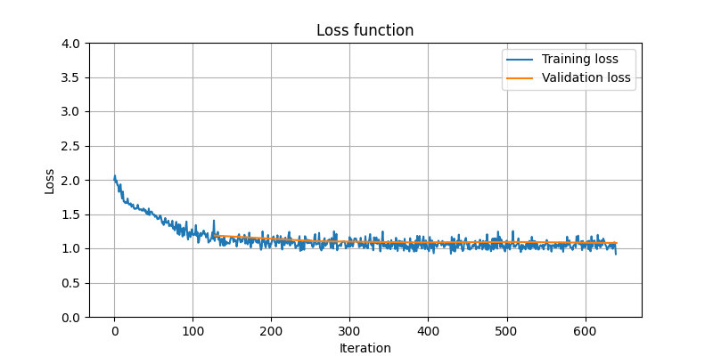

# Project in progress

Goal of the project is to use Reinforcement Learning to play DSJ2.

## Main tools used:
- PyTorch
- Python Imaging Library (PIL)
- pywin32
- numpy

## Game control

The game control is made using the pywin32 library. The GameController class contains implementations of all functionalities needed for automatic menu handling and jump execution.

## Data acquisition

Data acquisition is performed using the Python Imaging Library (PIL). The position of GUI elements does not change, so the extraction of individual image fragments and menu handling can be hardcoded.

## Backbone pretraining

To ease the learning process, pretraining is performed, during which the neural network learns to predict the following values:
- the time that has elapsed since the trial began
- the time that has elapsed since the flight began
- jumper position: run-up, bump, flight, landing (+ landing type)
- jumper inclination during flight

The training dataset is collected through an autolabeling function that collects images and tracks mouse movements made by the player.
The dataset contains ~5k images. Labels are stored in pandas DataFrame, example rows below:

|      | img        |   labels_total_time |   labels_flight_time |   labels_position |   labels_inclination |
|-----:|:-----------|--------------------:|---------------------:|------------------:|---------------------:|
| ... | ... |          ...   |          ...      |                 ... |                   .... |
| 2411 | 002411.png |           6.14007   |          2.0995      |                 1 |                   40 |
| 2412 | 002412.png |           6.24106   |          2.20047     |                 1 |                   40 |
| 2413 | 002413.png |           6.34006   |          2.29751     |                 1 |                   40 |
| 2414 | 002414.png |           6.44607   |          2.40347     |                 1 |                   41 |
| 2415 | 002415.png |           6.54236   |          2.49947     |                 1 |                   41 |
| 2416 | 002416.png |           6.63939   |          2.59983     |                 1 |                   41 |
| 2417 | 002417.png |           6.74141   |          2.69884     |                 1 |                   42 |
| 2418 | 002418.png |           6.84141   |          2.79984     |                 1 |                   42 |
| 2419 | 002419.png |           6.93938   |          2.89884     |                 1 |                   42 |
| 2420 | 002420.png |           7.04037   |          3.00086     |                 1 |                   42 |
| 2421 | 002421.png |           7.13941   |          3.09985     |                 1 |                   42 |
| 2422 | 002422.png |           7.23941   |          3.19881     |                 4 |                    0 |
| 2423 | 002423.png |           7.33941   |          3.29881     |                 4 |                    0 |
| 2424 | 002424.png |           7.44141   |          3.40181     |                 4 |                    0 |
| 2425 | 002425.png |           7.54137   |          3.49985     |                 4 |                    0 |
| ... | ...         |          ...        |          ...         |               ... |                 .... |

The neural network used is a resnet18 without the last fully connected layer, which was replaced by layers corresponding to the each value predicted by the network.

Training and validation loss is shown below. It can be assumed that the backbone is capable of extracting the features necessary to determine the values listed above.

 

